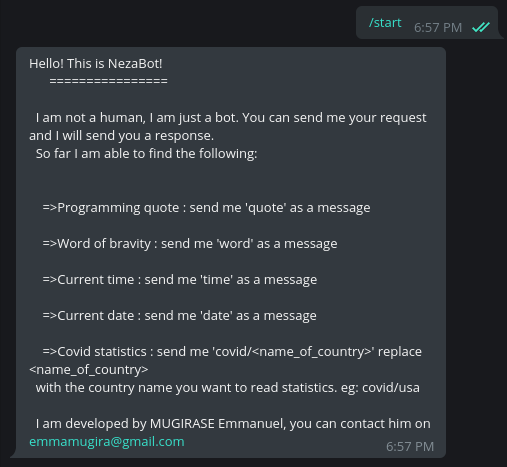
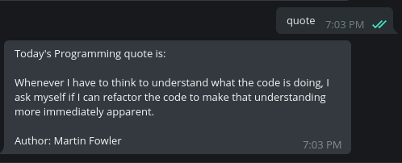
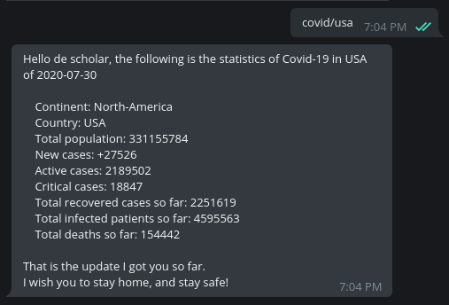
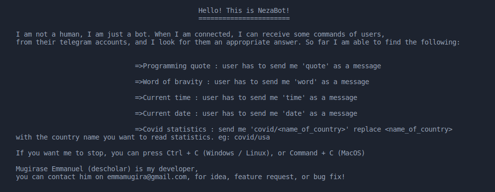

# Telegram-bot
    [](https://badge.fury.io/rb/telegram-bot-ruby)


## Vision
Since the raise of technology, it is very easy now to access to information. Nowadays people find themselves busy, they have a lot of schedulings, such as meetings to attend, their daily tasks that they need to complete, and at the same time they need to be connected with the world via information or news. The main problem here is that there some people who lack time to go on internet to research or they need some words of `encouragement`, or some `quotes`, and ofcourse to know the current status of the famous `Covid-19`.

Here, `telegram-bot` comes in as a solution. It provides very easy way of accessing to source of information, you just need to tell it what you want, and it will handle other works behind the curtains, and gives your appropriate answer from internet.

## Description
`telegram-bot` is a telegram-bot, this means you access it via [Telegram messenger](https://telegram.org/). It is built to make your life easy, don't spend your time looking for links where you can find current **covid statistics**, with a single message you send it via your **messenger chat**, it will pull information from online and brings you the solution. I will list other usefull solutions it brings you.

## Buit with
* [Ruby](https://www.ruby-lang.org/en/)

## Screenshots
|`/stat`|`/help`|`quote`|
|-|-|-|
||||

|`word`|`covid/usa`|`date`|
|-|-|-|
||


## Setup
To be able to use this `telegram-bot` follow the following steps

### Pre-requisites:
To be able to setup and run this product, you should have the following
1. [Ruby](https://www.ruby-lang.org/en/) installed on your computer
1. [Telegram account](https://telegram.org/)
1. Computer ready to run `terminal`, or `bash`

### Installation:
1. Clone, go in this repo by running `git clone https://github.com/descholar-ceo/telegram-bot.git && cd telegram-bot`
2. Create a file and name it `.env` in root directory of this project
3. Copy all of the fields which are in `.env.example` file you from the root directory => in next steps I will show you how you are going to get the values of those fields 
4. Click [here](https://t.me/BotFather) or go to your telegram and search for `@BotFather` and send him this message: `/newbot` and follow instruction untill you get your bot api token which appears to look like this: `123456:ABC-DEF1234ghIkl-zyx57W2v1u123ew11`
5. Copy it and paste it on the first field in your `.env` file, (that field is `TELEGRAM_BOT_API_TOKEN=`)
6. Go to [RapidApi](https://rapidapi.com/api-sports/api/covid-193?endpoint=apiendpoint_dfb9e52d-bd90-48ec-a571-8b78610a736d), Signup or signin, and get your `COVID_API_HOST, COVID_API_KEY` and `COVID_API_URL` from there. When you see the window which looks like the following on the screenshot, scroll down on the rightmost mindow, and copy the values of `request["x-rapidapi-host"]`: paste this value on `COVID_API_HOST` in your `.env` file, and copy the value of `request["x-rapidapi-key"]` and paste it on `COVID_API_KEY` in your `.env` file, last but not least for the `COVID_API_URL` use `https://covid-193.p.rapidapi.com/statistics`.

7. For the remaining fields use the following values:
```bash

    i.  WORD_OF_DAY_API=https://type.fit/api/quotes
    ii. PROGRAMMING_QUOTE_API=https://programming-quotes-api.herokuapp.com/quotes/lang/en

```
8. Run `bundle install` => To install all gems

### Usage
1. Run `bin/main.rb` => To start your `telegram-bot`. To this point you should see in your terminal a window which looks like the following on the screenshot:

2. Now your bot is alive and is able to follow the commands you give, go in your telegram messenger, and look for your bot, the bot name you provided to the botfather on step 4.
3. Once you found it, click on `START` button, and start chatting with it, in last step, I will show you the list of commands the bot can understand so far
#### 12. List of messages (commands) currently this bot will respond to are:
```bash
  1. message : /start   =>  response : Greeting and introduction
  2. message : /help    =>  response : List of all available messages (commands)
  3. message : word     =>  response : Word of bravity of the day
  4. message : quote    =>  response : Today programming quote
  5. message : time     =>  response : To get current time
  6. message : date     =>  response : To get current date
  7. message : covid/<name_of_country   =>  response : To read covid-19 statistics of any country
  
  ===>remember to replace <name_of_country> with the country name you want to read its statistics,
  example: covid/usa
```
### Running tests locally
If all of the installations went well in the previous step, then you will be able to run tests
1. Initialize RSpec by running `rspec --init`
1. Run `rspec` If you get some failure under `LookUp #read`, make sure that you have a stable internet connectivity

## Gems used
```bash

1. dotenv
2. json
3. net-http-persistent
4. rspec
5. rubocop
6. telegram-bot-ruby

```

## Author (s)
### 1. MUGIRASE Emmanuel
* Github: [@descholar-ceo](https://github.com/descholar-ceo)
* Twitter: [@descholar3](https://twitter.com/descholar3)
* LinkedIn: [MUGIRASE Emmanuel](https://www.linkedin.com/in/mugirase-emmanuel-a90b49143)

## Contributions

There are two ways of contributing to this project:

1.  If you see something wrong or not working, please check [the issue tracker section](https://github.com/descholar-ceo/telegram-bot/issues ), if that problem you met is not in already opened issues then open the issue by clicking on `new issue` button.

2.  If you have a solution to that, and you are willing to work on it, follow the below steps to contribute:
    1.  Fork this repository
    1.  Clone it on your local computer by running `git clone https://github.com/your-username/telegram-bot.git` __Replace *your username* with the username you use on github__
    1.  Open the cloned repository which appears as a folder on your local computer with your favorite code editor
    1.  Create a separate branch off the *master branch*,
    1.  Write your codes which fix the issue you found
    1.  Commit and push the branch you created
    1.  Raise a pull request, comparing your new created branch with our original master branch [here](https://github.com/descholar-ceo/telegram-bot)

## Show your support 
Give a ⭐️ if you like this project!

## Acknowledgment
* [Microverse](https://microvese.org): My great school
* [telegram-bot-ruby](https://github.com/atipugin/telegram-bot-ruby): It's a gem I used while creating this project
